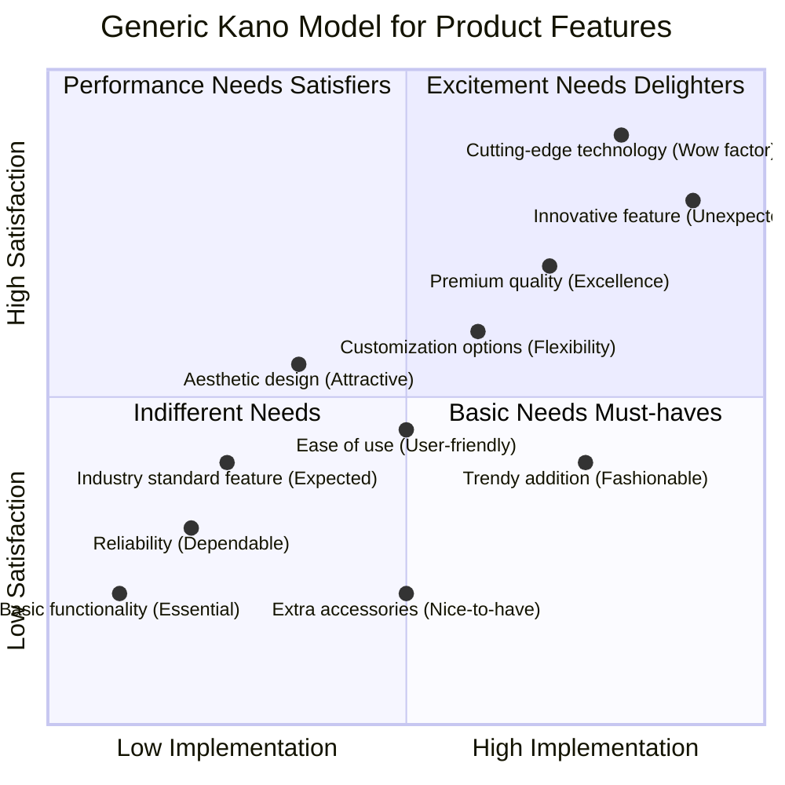
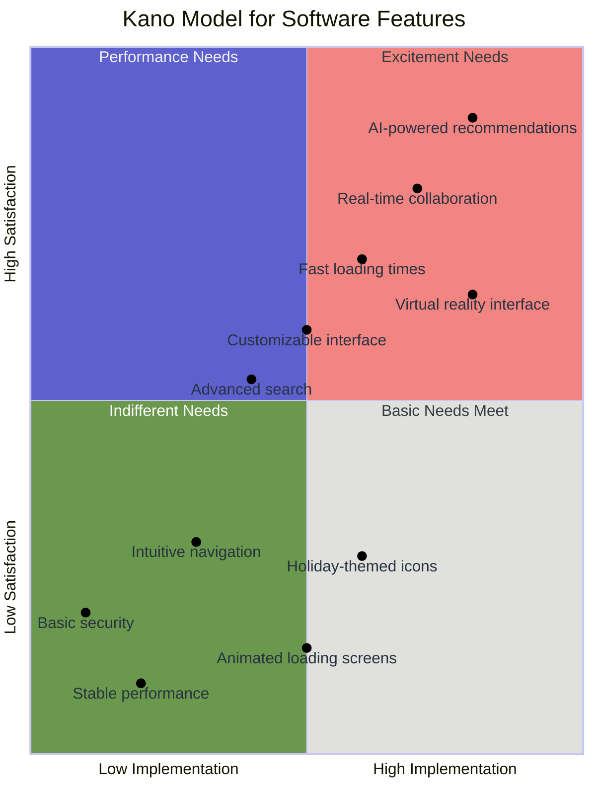

# 🗼
The bustling streets of Tokyo faded into the background as Akira Tanaka, lead product manager at NexGen Software, stepped into the company's sleek conference room. The team had gathered for a crucial meeting to prioritize features for their revolutionary project management software.

Akira's eyes swept across the room, taking in the mix of excitement and apprehension on his team's faces. He knew they needed a fresh approach to feature prioritization. With a confident smile, he turned to the large touchscreen display dominating one wall.

"Team," Akira began, his voice calm but filled with enthusiasm, "today we're going to look at our project through a new lens: the Kano model."

As Akira spoke, he brought up a quadrant diagram on the screen:

> [!IMPORTANT]
> The Kano model helps us categorize features based on customer satisfaction and our level of implementation. It has four main quadrants:
> 1. Basic Needs: Must-have features. Their absence causes dissatisfaction, but their presence doesn't increase satisfaction much.
> 2. Performance Needs: The better we implement these, the more satisfaction increases.
> 3. Excitement Needs: Unexpected features that delight users when implemented well.
> 4. Indifferent Needs: Features that don't impact satisfaction much either way.

The team leaned forward, intrigued by this new approach.

🟡 Yuki, the UX designer, was the first to speak up. "So, for Basic Needs,
we're talking about things like stable performance and basic security, right? They'd be in the lower-left quadrant?"

Akira nodded, plotting these on the diagram. "Exactly. What else?"

"Intuitive navigation," chimed in Hiro, the UI specialist. "Users expect it, but won't praise us for it."

🟡 As they moved to Performance Needs, the discussion heated up.

"Fast loading times," suggested Mei, the backend developer. "The faster we make it, the happier users will be."
"Customizable interface," added Hiro. "Users love to make the software their own."
"And don't forget advanced search functionality," Yuki reminded them.

Akira added each suggestion to the growing diagram, placing them diagonally across the Performance Needs quadrant.

🟡 When they reached Excitement Needs, the room buzzed with energy.

"What about AI-powered recommendations?" proposed Kenji, the AI specialist, his eyes gleaming.
"Or a virtual reality interface for visualizing project timelines?" suggested Yuki, always thinking ahead.
"Real-time collaboration features could be a game-changer," Mei added thoughtfully.

Akira plotted these in the upper-right quadrant, noting how they could significantly boost satisfaction if implemented well.

🟡 As they discussed Indifferent Needs, the team realized some of their ideas might not matter as much to users.

"Animated loading screens?" Hiro suggested hesitantly.
"Holiday-themed icons?" Yuki mused. "Nice, but not essential."

These found their place in the lower-right quadrant, acknowledging their minimal impact on user satisfaction.

___

As the Kano model quadrant filled up, the team's path forward became clearer. They focused their efforts on nailing the Basic Needs, optimizing the Performance Needs, and strategically implementing some Excitement Needs to set their software apart.

Weeks of intense development followed. When challenges arose, like balancing the AI recommendations with user privacy, they returned to the Kano model for guidance, adjusting their implementation levels to maximize user satisfaction.

🚀 Launch day arrived with a mix of anticipation and nervousness. As the first users logged in, the team huddled around their analytics dashboard.

✨ The response was overwhelming. Users praised the software's stability and intuitive design (Basic Needs), raved about its speed and customization options (Performance Needs), and expressed delight at the AI recommendations and VR interface (Excitement Needs).

> One review stood out: "It's like this software reads my mind! Fast, intuitive, and with features I didn't even know I wanted. NexGen has hit it out of the park!"

🌆 As the sun set over Tokyo's skyline, casting a warm glow through the office windows, the NexGen team celebrated their success. Akira raised a glass of sake, "To the Kano model, and to understanding our users better than they understand themselves!"

🎉 The team cheered, already excited about applying their newfound knowledge to the next version. They had climbed the mountain of software development, guided by the Kano model's quadrant view, and the view from the top was breathtaking.