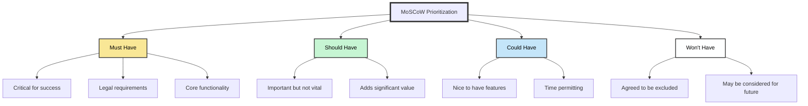

## 🏞️ Setting the Scene
In the heart of Silicon Valley, the FinanceFlow team gathered around a large whiteboard, the air thick with anticipation and the aroma of strong coffee. Sarah Chen, their product manager, uncapped a marker with a determined click.
"Alright team," she began, her voice steady, "we're about to revolutionize mobile banking, but we can't do everything at once. We need to prioritize."
## 🏔️ The Climb Begins
Sarah drew four large boxes on the board, labeling them as she spoke:
## 📊 MoSCoW Method Overview
"M - Must Have: These are non-negotiable. Without these, we fail." 
"S - Should Have: Important, but not critical for launch." 
"C - Could Have: Nice-to-haves if time permits." 
"W - Won't Have: Not for this version, but maybe later."

The room fell silent as the team absorbed the simplicity and power of the MoSCoW method.

## What followed was a lively debate as features were proposed and categorized:

### Must Have:

"Secure user authentication is non-negotiable," insisted Maria from legal. 
"Basic account management and money transfers are the core of what we do," added Alex, the lead developer. 
"And we must be compliant with financial regulations," Maria reminded everyone.

## Should Have:

"Bill payments would be a huge value-add," suggested Raj from the AI team. 
"A savings goals tracker could set us apart," mused the UX designer. 
"Push notifications for transactions?" someone called out. "Definitely a should have."

## Could Have:

"Integration with budgeting tools would be nice," Sarah noted. 
"What about that AI chatbot for customer support, Raj?" 
"Cryptocurrency exchange?" someone ventured. After some debate, it landed in the "Could Have" category.

## Won't Have (this release):

"Investment portfolio management is too complex for v1," Sarah decided. 
"International money transfers can wait," agreed the team. 
"And let's hold off on a loyalty rewards program for now."

As the categories filled up, the team could see their app taking shape. The MoSCoW method had transformed a daunting list of features into a clear, prioritized plan.

```mermaid
graph TD
    A[MoSCoW Prioritization for FinanceFlow App] --> B[Must Have]
    A --> C[Should Have]
    A --> D[Could Have]
    A --> E[Won't Have]
    
    B --> B1[Secure user authentication]
    B --> B2[Basic account management]
    B --> B3[Money transfer functionality]
    B --> B4[Compliance with financial regulations]
    
    C --> C1[Bill payment feature]
    C --> C2[Savings goals tracker]
    C --> C3[Push notifications for transactions]
    
    D --> D1[Integration with budgeting tools]
    D --> D2[Chatbot for customer support]
    D --> D3[Cryptocurrency exchange]
    
    E --> E1[Investment portfolio management]
    E --> E2[International money transfers]
    E --> E3[Loyalty rewards program]

classDef default stroke:#333,stroke-width:2px;
classDef mustHave fill:#F9E796,stroke:#333,stroke-width:2px,color:black
classDef shouldHave fill:#C6F5D3,stroke:#333,stroke-width:2px,color:black
classDef couldHave fill:#C4E5F9,stroke:#333,stroke-width:2px,color:black
classDef wontHave fill:#FEFFFF,stroke:#333,stroke-width:2px,color:black

class A default;
class B,B1,B2,B3,B4 mustHave;
class C,C1,C2,C3 shouldHave;
class D,D1,D2,D3 couldHave;
class E,E1,E2,E3 wontHave;
```

## The Summit Push
In the weeks that followed, the FinanceFlow team raced against time, focusing their efforts on the "Must Haves" and key "Should Haves." 
When unexpected challenges arose, like the complex secure authentication system, they referred back to their MoSCoW board, making tough but informed decisions.

## 🏆 The View from the Top
Launch day arrived, and as the first users downloaded the app, the team watched anxiously.
The reviews started pouring in: 
>"Secure, intuitive, and focused on the essentials. Finally, a banking app that gets it right!"

Sarah smiled, thinking of their MoSCoW board. They had launched with all their "Must Haves" and most "Should Haves," creating a solid foundation for future growth.

As the sun set over Silicon Valley, casting a golden glow on their office, the FinanceFlow team celebrated their success. They had climbed the mountain of app development, **guided by the MoSCoW method**, and the view from the top was spectacular.

>Sarah raised her glass in a toast: "To MoSCoW, and to our journey ahead. Those 'Could Haves' won't know what hit them in v2!"

The team cheered, already looking forward to their next climb, armed with their trusty prioritization tool and the lessons learned from their incredible journey.