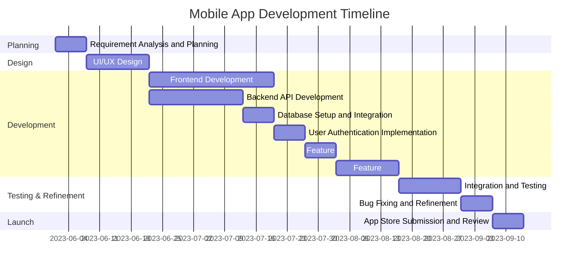

# 💻 From Spaghetti Code to Streamlined Success

## 🥵 The Overwhelmed Developer

Sarah sighed as she stared at the cluttered Trello board on her screen. As the lead developer for her startup's new mobile app, she felt overwhelmed by the sheer number of features and bug fixes that needed to be completed before their fast-approaching launch date. 😰

"There has to be a better way to organize all of this," she muttered, scrolling through the seemingly endless list of tasks.

> Just then, her colleague Tom, a seasoned project manager, walked by and noticed her distress. "Hey Sarah, have you ever considered using a Gantt Chart to manage your development timeline?"

Sarah looked up, curiosity piqued. "A Gantt what now?"

Tom smiled, "Let me show you. It's a game-changer for visualizing project timelines, especially during the requirement analysis and development phases."

## 📊 Understanding Gantt Charts in Software Development

> [!IMPORTANT]
> 📘 **Gantt Chart Summary**
>
> A Gantt Chart is a horizontal bar chart used in project management to illustrate a project schedule. In software development, it can display:
> - The start and end dates of each development task or sprint
> - How long each task or feature development will take
> - Where tasks overlap or depend on each other
> - The start and end date of the entire development cycle
>
> Key benefits of Gantt Charts in software development:
> 1. Provides a clear visual of the development timeline
> 2. Shows task dependencies and critical paths
> 3. Helps in resource allocation across different parts of the project
> 4. Facilitates progress tracking and sprint planning
> 5. Improves communication among team members and stakeholders

As Tom explained the concept, Sarah's eyes lit up. She could already see how this tool could bring order to her chaotic development process.

"But how exactly would I use this for our app development?" Sarah asked.

"Well," Tom replied, "let's break it down using your mobile app as an example."

## 📱 A Real-Life Example: Mobile App Development

Tom helped Sarah identify the main tasks for the app development and their estimated durations:

1. Requirement Analysis and Planning (1 week)
2. UI/UX Design (2 weeks)
3. Frontend Development (4 weeks)
4. Backend API Development (3 weeks)
5. Database Setup and Integration (1 week)
6. User Authentication Implementation (1 week)
7. Feature Implementation: Social Sharing (1 week)
8. Feature Implementation: In-App Purchases (2 weeks)
9. Integration and Testing (2 weeks)
10. Bug Fixing and Refinement (1 week)
11. App Store Submission and Review (1 week)

"Now," Tom said, "let's visualize this in a Gantt Chart."

He quickly sketched out a chart, which Sarah later recreated digitally:

Sarah's eyes widened as she took in the chart. "This is incredible!" she exclaimed. "I can see the entire development process at a glance!"

Tom nodded, "Exactly. Notice how you can easily see which tasks overlap, which ones depend on others, and how long each task will take. This visual representation makes it much easier to manage your time and resources effectively."

## 📈 The Power of Gantt Charts in Software Development
As Sarah studied the chart, Tom explained further, "In the context of software development and requirement analysis, Gantt Charts are particularly useful. They help you:

- Visualize the scope of the project over time
- Identify potential bottlenecks or conflicts in the development timeline
- Communicate the project plan clearly to stakeholders and team members
- Track progress and adjust timelines as needed
- Ensure all features and requirements are accounted for and properly scheduled
- Plan sprints and allocate resources efficiently

For your app, this chart clearly shows that frontend and backend development can start simultaneously after the design phase, and that certain features like social sharing and in-app purchases can be implemented in parallel with other tasks."

Sarah nodded enthusiastically, already feeling more in control of her project. "This is going to make everything so much easier to manage. I can see exactly what needs to be done and when. It's like having a roadmap for the entire development process!"

## 🎉 The Successful Launch
Three months later, Sarah stood in front of her team, champagne in hand, celebrating the successful launch of their mobile app. The app was receiving rave reviews, and user adoption was exceeding all expectations.

As she toasted to their success, Sarah thought back to that moment of overwhelm in her office. The Gantt Chart had indeed been a game-changer, helping her stay on top of every development task and deadline.

She made a mental note to thank Tom again and to use Gantt Charts for all her future projects. Who knew that a simple bar chart could bring such clarity and success to software development? 🚀