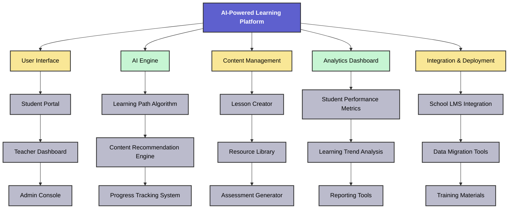

# 🚀 From Chaos to Clarity: How WBS Saved TechNova's Dream

## 🚥 The Pivotal Moment

Sarah's hands trembled as she stared at the email on her screen. The potential investor's words burned into her retinas: "Your project scope lacks clarity. We're putting our funding decision on hold." 😰

TechNova, the AI-driven education startup she had poured her heart and soul into for the past year, was on the brink of collapse. With only two weeks of runway left, Sarah knew she had to act fast or watch her dreams crumble.

As panic threatened to overwhelm her, a memory flickered in the back of her mind. Something about a project management technique her mentor had once mentioned... Work Breakdown Structure? Could that be the key to salvaging TechNova's future?

## 🛣 The Journey Begins

**Three months earlier...**

Sarah beamed as she addressed her small but passionate team. "We did it, folks! Our AI-powered personalized learning platform prototype is complete. Now, we need to scale it up for our first school district pilot."

The excitement in the room was palpable. TechNova's mission to revolutionize education through AI seemed within reach. Little did they know the challenges that lay ahead.

As weeks passed, the team found themselves drowning in a sea of tasks. Feature creep set in, deadlines were missed, and team morale plummeted. Sarah's inbox filled with concerned messages from their pilot school district and potential investors.

One particularly frustrating day, Sarah reached out to her mentor, Dr. Rodriguez, a seasoned project manager. "It feels like we're losing control," Sarah confessed. "We have so many ideas, but we can't seem to organize them effectively."

Dr. Rodriguez nodded knowingly. "It sounds like you need a Work Breakdown Structure, or WBS. It's a powerful tool for scope definition in project management."

> 📘 **WBS (Work Breakdown Structure) Summary**
>
> A Work Breakdown Structure is a hierarchical decomposition of the total scope of work to be carried out by the project team to accomplish the project objectives and create the required deliverables. It organizes and defines the total scope of the project, breaking it down into smaller, more manageable components.
>
> Key benefits of WBS:
> 1. Provides a clear visual of the project scope
> 2. Helps in identifying all necessary tasks
> 3. Facilitates accurate time and cost estimation
> 4. Improves resource allocation
> 5. Enhances project control and monitoring

Sarah listened intently as Dr. Rodriguez explained the concept. Hope began to flicker in her eyes. "This could be exactly what we need," she thought.

## 📈 The Turning Point

Armed with newfound knowledge, Sarah called an emergency team meeting. "Team, we're going to restructure our approach using a Work Breakdown Structure," she announced, her voice filled with determination.

Over the next few days, the team worked tirelessly to break down their project into manageable components. They started with the main deliverable - the AI-powered learning platform - and methodically decomposed it into smaller, more specific elements.

### Here's a simplified version of the WBS they created:

As the WBS took shape, a sense of clarity washed over the team. They could now see the entire project laid out before them, each component neatly organized and interconnected.

"This is incredible," whispered Jake, the lead developer. "I can actually visualize how my work fits into the bigger picture now."

Sarah nodded, a smile spreading across her face. "And look how it helps us identify potential risks and dependencies. We can allocate our resources much more effectively now."

## 🎢 The Road to Success

With the WBS as their guide, TechNova underwent a dramatic transformation. Task allocation became more precise, timelines more realistic, and progress more measurable. The team's productivity soared as each member understood exactly where their efforts fit in the grand scheme.

As the two-week deadline approached, Sarah put the finishing touches on their revised project proposal. The WBS diagram took center stage, showcasing TechNova's clear vision and meticulous planning.

With a deep breath, she hit 'Send' on the email to their potential investors.

## 🎉 The Triumphant Conclusion

> Sarah's phone buzzed. Her heart skipped a beat as she recognized the investor's number. With trembling hands, she answered the call."Sarah," the investor's voice boomed through the speaker, "I must say, I'm impressed. The clarity and organization in your revised proposal are exactly what we were looking for. We're ready to move forward with the funding."

Relief and joy washed over Sarah. She looked around at her team, all wearing anxious expressions. With tears of happiness in her eyes, she gave them a thumbs up. The room erupted in cheers. 

As the celebration died down, Sarah's thoughts drifted to that crucial moment when everything seemed lost. Who would have thought that a simple project management tool - the Work Breakdown Structure - would be the key to turning their chaos into clarity, and their dreams into reality?

TechNova's journey was far from over, but with their newfound understanding of scope management and the power of WBS, Sarah knew they were well-equipped to face whatever challenges lay ahead. The future of AI in education looked brighter than ever, and TechNova was leading the charge.